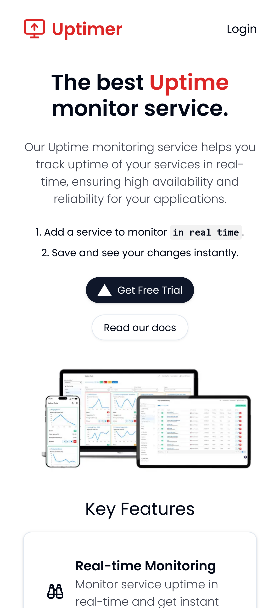
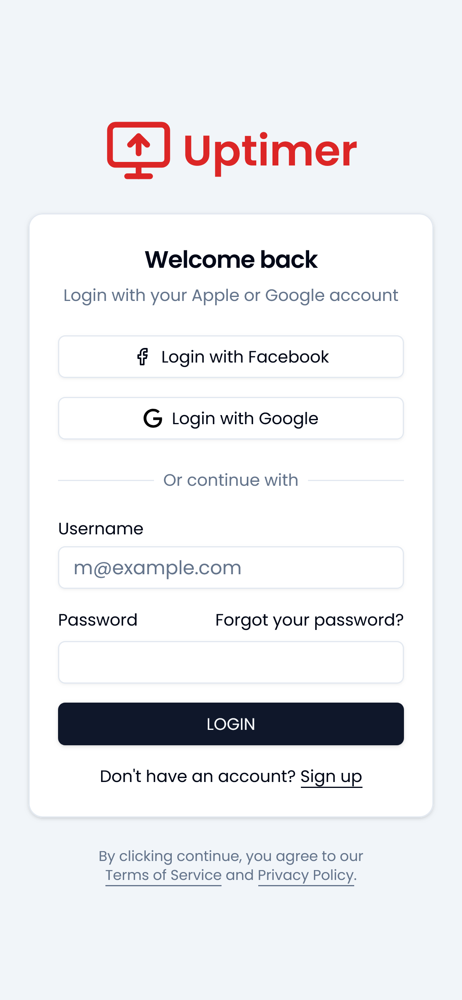
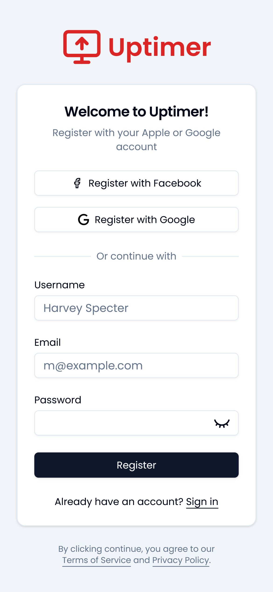
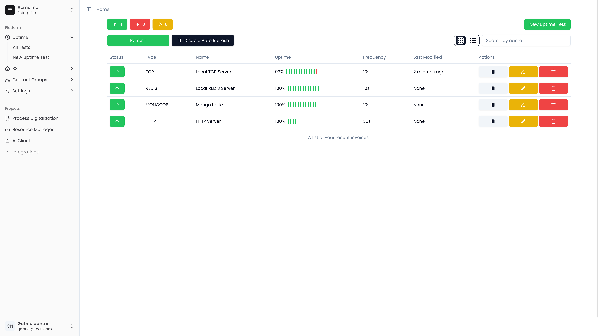
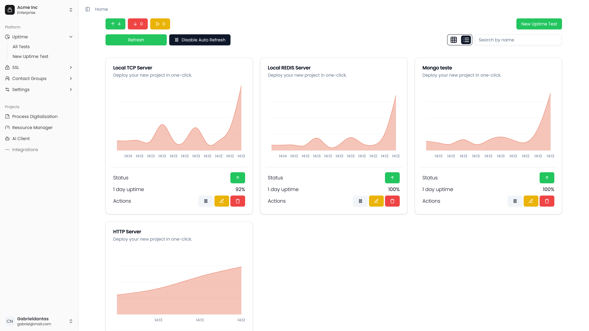
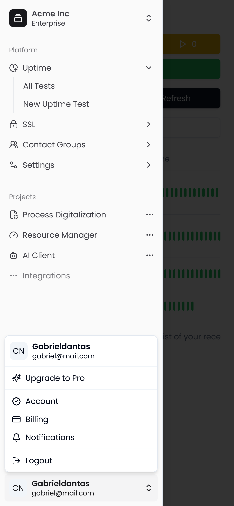
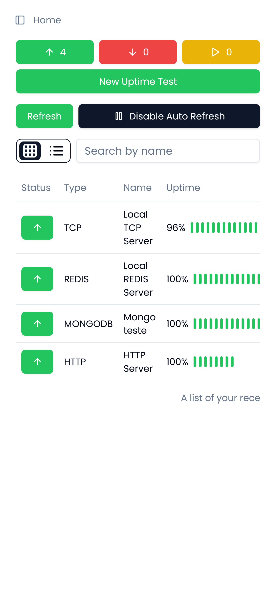
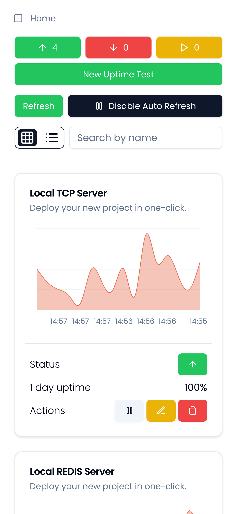

<div id="top"></div>

<!-- PROJECT LOGO -->
<br />
<div align=center>
  
  # Uptimer Monitor

[![Next][next.js]][next-url]
[![React][react.js]][react-url]
[![Node][node.js]][node-url]
[![GraphQL][graphql]][graphql-url]
[![MongoDB][mongodb]][mongodb-url]
[![Apollo][apollo]][apollo-url]

</div>

<!-- TABLE OF CONTENTS -->
<details>
  <summary>
    <a href="#about-the-project">About The Project</a>
  </summary>
  <ol>
    <li>
      <a href="#technologies">Technologies</a>
      </li>
      <li>
        <a href="#functionalities">Functionalities</a>
        <ul>
          <li><a href="#available-in-server">Available in the Server</a></li>
          <li><a href="#available-in-client">Available in the Client</a></li>
          <li><a href="#not-implemented">Not implemented</a></li>
        </ul>
    </li>
      <li>
        <a href="#screenshots">Screenshots</a>
        <ul>
          <li><a href="#public-pages">Public Pages</a></li>
          <li>
            <a href="#admin">Admin Dashboard</a>
            <ul>
          <li><a href="#desktop">Desktop</a></li>
          <li><a href="#mobile">Mobile</a></li>
        </ul>
          </li>
        </ul>
    </li>
    <li>
      <a href="#executing-locally">Executing the code locally</a>
      <ul>
        <li><a href="#installation">Installation</a></li>
            <li><a href="#contributing">Contributing</a></li>
      </ul>
    </li>
    <li><a href="#contact">Contact</a></li>
  </ol>
</details>

<p align="right">(<a href="#top">back to top</a>)</p>

# REST API with Spring Boot and Angular

<div id="about-the-project"></div>


A basic Angular + Spring delivery system demonstrating the Has-Many relationship.

This app is to showcase, especially for beginners, what a basic CRUD API that's close to being Production-ready looks like.

## 💻 Technologies

<div id="technologies"></div>

- Node.js
- Next.js v14 (App Routes)
- Apollo Server/Client
- Graphql
- Docker
- Express
- MongoDB
- Sequelize
- PostgreSQL
- Firebase
- Nodemailer
- Croner
- Zod

## Some functionalities available in the Server

<div id="available-in-server"></div>

- ✅ Handle authentication/authorization with JWT
- ✅ NextJS client application with Apollo Client to GraphQL server
- ✅ TailwindCSS to style elements in a NextJS application
- ✅ GraphQL server based on NodeJS, Express and Apollo Server
- ✅ GraphQL WebSocket Subscriptions to publish and consume messages in real time
- ✅ PostgreSQL database (you can use any database of your preference)
- ✅ Flexible data schemas with GraphQL
- ✅ Shadcn Components
- ✅ Charts (Shadcn + Recharts)
- ✅ Caching

## Some functionalities available in the client

<div id="available-in-client"></div>

- ✅ Login via Google and Facebook providers
- ✅ React components
- ✅ Shadn UI Interface
- ✅ Responsive Interface
- ✅ Dark🌛 / Light🌞 mode
- ✅ List of all main services with pagination
- ✅ Form to update/create services (Zod validation)
- ✅ View only screen
- ✅ Caching rendering work and data requests

### Not implemented (maybe in a future version)

<div id="not-implemented"></div>

- Unit and end-to-end testing
- Data Compression
- Throttling e Rate-limiting
- Test Containers
- Docker Build
- Node.js api documentation with swagger
- CI workflow with Github Actions

## Screenshots

<div id="ccreenshots"></div>

### Public Pages:

<div id="public-pages"></div>

<table>
  <thead>
    <th>
      Main Page
    </th>
    <th>
      Login Page
    </th>
    <th>
      Register Page
    </th>
  </thead>
  <tbody>
    <td></td>
    <td></td>
    <td></td>
  </tbody>
</table>

### Admin Dashboard:

<div id="admin"></div>

#### Desktop:

<div id="desktop"></div>
<table>
  <thead>
    <th>
      Table View
    </th>
    <th>
      Grid View
    </th>
  </thead>
  <tbody>
    <td></td>
    <td> </td>
  </tbody>
</table>

#### Mobile:

<div id="mobile"></div>

<table>
  <thead>
   <th>
      Sidebar
    </th>
   <th>
      Table View
    </th>
    <th>
      Grid View
    </th>
  </thead>
  <tbody>
    <td></td>
    <td></td>
    <td> </td>
  </tbody>
</table>

## ❗️Executing the code locally

<div id="executing-locally"></div>

<!-- GETTING STARTED -->

### Getting Started

To get a local copy up and running follow these simple example steps.

### Prerequisites

This is an example of how to list things you need to use the software and how to install them.

- Node.js

  ```sh
  https://nodejs.org/en/download/
  ```

- Docker

  ```sh
  https://www.docker.com/get-started/
  ```

### Installation

<div id="installation"></div>
Clone the repo

```sh
git@github.com:GabrielDantas-99/uptimer-monitor.git
```

1. Install packages: Inside uptimer-monitor/web and uptimer-monitor/server

   ```sh
   npm install
   ```

2. Run the container(or stop it, if necessary):

   ```sh
   npm compose:up
   ```

3. Run the Project

   ```sh
   npm dev
   ```

Open your browser and access **http://localhost:3000** (Next.js default port).

<!-- CONTRIBUTING -->

### Contributing

<div id="contributing"></div>
Contributions are what make the open source community such an amazing place to learn, inspire, and create. Any contributions you make are **greatly appreciated**.

If you have a suggestion that would make this better, please fork the repo and create a pull request. You can also simply open an issue with the tag "enhancement".
Don't forget to give the project a star! Thanks again!

1. Fork the Project
2. Create your Feature Branch (`git flow feature start feature_branch`)
3. Commit your Changes (`git commit -m 'my feature is awesome'`)
4. Finish your branch (`git flow feature finish feature_branch`)
5. Push to the Branch (`git push origin dev`)
6. Open a Pull Request

<p align="right">(<a href="#top">back to top</a>)</p>

<!-- CONTACT -->

## Contact

Project Link: https://github.com/GabrielDantas-99/uptimer-monitor

<p align="right">(<a href="#top">back to top</a>)</p>

<!-- MARKDOWN LINKS & IMAGES -->
<!-- https://www.markdownguide.org/basic-syntax/#reference-style-links -->

[next.js]: https://img.shields.io/badge/Next.js-000000?style=for-the-badge&logo=nextdotjs&logoColor=white
[next-url]: https://nextjs.org/
[react.js]: https://img.shields.io/badge/React-20232A?style=for-the-badge&logo=react&logoColor=61DAFB
[react-url]: https://reactjs.org/
[node.js]: https://img.shields.io/badge/NodeJS-339933?style=for-the-badge&logo=nodedotjs&logoColor=white
[node-url]: https://nodejs.org/
[graphql]: https://img.shields.io/badge/Graphql-E10098?style=for-the-badge&logo=graphql&logoColor=white
[graphql-url]: https://graphql.org/
[mongodb]: https://img.shields.io/badge/MongoDB-47A248?style=for-the-badge&logo=mongodb&logoColor=white
[mongodb-url]: https://mongodb.com
[apollo]: https://img.shields.io/badge/ApolloServer-13222a?style=for-the-badge&logo=apollographql&logoColor=c7cfce
[apollo-url]: https://www.apollographql.com/docs
